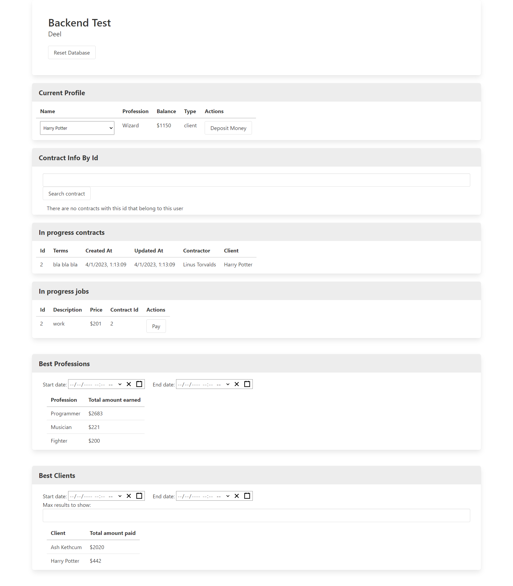
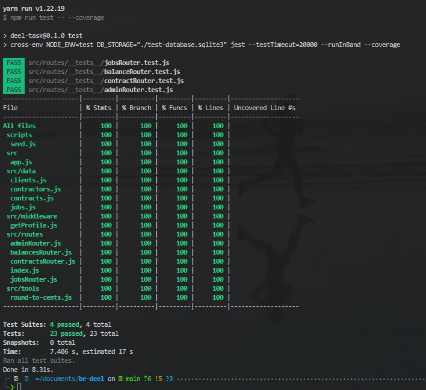

# 👋 Welcome

This is my implementation of the [Deel Backend Test](./REQUIREMENTS.md).

## 📜 Requirements for running the application

 - You need to have `nodejs v18.12.1` installed.
 - If you use `nvm`, run `nvm install v18.12.1` (in case you don't have that version installed) and the `nvm use`


## ▶️ Run the Application

If this is the first time you are going to use the App and you want to skip all the detailed steps,
Run any of the following commands to prepare and run the production version of the application:


⚠️ WARNING!
Running any of them will drop the database and fill it with the default initial values.

```bash
npm run plug-and-play
```

or

```bash
yarn plug-and-play
```

Once you see the log:
> Express App Listening on Port 8080

open [http://localhost:8080](http://localhost:8080).

<details>
  <summary>If you see the following app, you are all set 🚀 </summary>



</details>

<details>
  <summary>See the detailed explanation of the previous command </summary>

### Commands that run with the `plug-and-play` command

1. `npm install`: This install all the packages needed by the backend
2. `cd client && npm install`: install the packages used by the frontend application (React App)
3. `cd client && npm run build`: Creates the static built version of the Frontend, the server will use the folder `./client/build` as the static site for the `/` route
4. `npm run seed`: This drops the database, then it creates the models and fill them with initial data. The DB is stored in `database.sqlite3`
5. `cross-env PORT=8080 node ./src/server.js`: This runs the server in the 8080 PORT

</details>

## Structure of the application

### Backend

The backend is an express App that has some endpoints for consulting and updating the database records,
it follows the next folder structure

```
|--src
   |--server.js      # Entry point of the server
   |--app.js         # Define the express app and routes
   |--models.js      # Define the tables and relationships for the database
   |--data           # Contains the initial data of every model
   |   |--...
   |
   |--middleware
   |   |--getProfile # Middleware to get the current profile info from the database, it uses the header `profile_id`
   |
   |--routes         # Every file here defines a subpath of the application, organizing routes by modules.
       |--...
```

#### Scripts

 - `npm run seed` or `yarn seed`:  This drops the database, then it creates the models and fill them with initial data. The DB is stored in `database.sqlite3`
 - `npm run start:prod` or `yarn start:prod`: Runs the server in production mode (port 8080). This server won't be reloaded by changes in files.
 - `npm run start` or `yarn start`: Runs the server in development mode(port 3001). Every time a file is changed, the server is reloaded
 - `npm run start:fullstack` or `yarn start:fullstack`: Runs both, the backend (port 3001) and the frontend (port 3000) in development mode in the same terminal.
 - `npm run test` or `yarn test`: Run backend unit tests using JEST
 - `npm run coverage` or `yarn coverage`: Run backend tests coverage using JEST, <details><summary> See this example</summary>  </details>
  
#### Bonus points

- [x] Concurrency
- [x] Transactions
- [x] Unit Tests
- [x] Docs

### Client

The client is a React+Typescript App created by the create-react-app command inside `./client` directory

```
|--client
    |--build              # Static version of the React App
    |--src
        |--index.ts       # Entry point of the client
        |--app.tsx        # Main component of the React App
        |--components     # Each folder inside this dir is a component that showcase specific Backend endpoints
            |--...
```

#### Scripts

**Important❗** These scripts should be executed inside the `./client` dir

 - `npm run start` or `yarn start`: Runs the client in development mode(port 3000). Every time a file is changed, the app is reloaded.
 It uses a proxy to make requests to the sever in the 3001 port
 - `npm run build` or `yarn build`: Creates the static version of the React App
  
#### Bonus points

- [x] Frontend to showcase the Backend
- [x] Typescript
- [x] Docs


> Thank you!
>
> -- <cite>Enrique Magallón</cite>